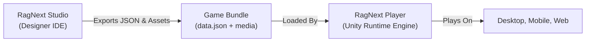

# Chapter 1: Getting Started & RagNext Architecture

Welcome to **RagNext**, the modern cross-platform interactive fiction, visual novel, and adventure game creation engine. Whether you are building classic text-based RPGs, rich point-and-click graphic adventures, or complex visual GUI games, RagNext gives you a professional suite of tools to craft your vision.

---

## 1.1 What is RagNext & RagNext Studio?

RagNext consists of two primary components:

1. **RagNext Studio** (`RagNext.Designer.Avalonia`): A powerful desktop IDE built on Avalonia UI. Studio allows game creators to design game worlds, author narrative logic using a visual node graph, build interactive screen GUI overlays, manage audio/media assets, and live playtest games without writing C# code.
2. **RagNext Player** (`RagNextPlayer`): A high-performance Unity-based runtime engine responsible for executing game logic, rendering 2D/3D graphics, handling UI Toolkit responsive layouts, playing sound FX/music, and running action step pipelines across Windows, macOS, iOS, Android, and WebGL.



---

## 1.2 System Requirements & Installation

### System Requirements
- **Operating System**: Windows 10/11, macOS 12+, or Linux (Ubuntu 22.04+).
- **Runtime Framework**: .NET 9.0 Runtime SDK.
- **Graphics Engine (Player)**: DirectX 11+, Metal, or Vulkan compatible GPU.

### Installation & Launching
1. Download the latest `RagNext-Studio` release archive or clone the repo from GitHub.
2. Launch `RagNext.exe` (or `./RagNext` on macOS/Linux).
3. The **Workspace Welcome Shell** will open.

---

## 1.3 The Studio Workspace Shell

The RagNext Studio user interface is divided into **four main functional regions**:

```
+-----------------------------------------------------------------------------------+
| Top Navigation & Action Rail (Nav Rail / Focus Canvas / Playtest / Save)           |
+-------------------+---------------------------------------+-----------------------+
| Left Sidebar      | Main Workspace / Canvas View          | Property Inspector    |
| (Entity Tree List)|                                       | (Attributes, Actions) |
| - Rooms           | - Text Editor / Visual Graph          |                       |
| - Objects         | - Interactive Screen 16:9 Canvas      |                       |
| - Characters      | - Global Variables / Timers           |                       |
| - Functions       |                                       |                       |
+-------------------+---------------------------------------+-----------------------+
| Status Bar & System Output                                                        |
+-----------------------------------------------------------------------------------+
```

### 1. Left Sidebar (Entity Tree List)
Displays your game world hierarchy:
- 📁 **Rooms**: All geographical locations in your game.
- 🎒 **Objects**: Items, keys, containers, and interactive environmental props.
- 👤 **Characters**: NPCs, enemies, and companions.
- ⚙️ **Variables & Timers**: Global game state and interval triggers.
- 🧩 **Global Functions**: Shared reusable action sequences.

### 2. Main Workspace & Canvas View
The central tabbed panel where game authoring occurs:
- **Properties Tab**: Edit name, description, picture asset, and attributes.
- **Interactive Screen Tab**: Visually position hotspots on a 16:9 canvas.
- **Actions Tab**: View and manage room/object narrative verbs.
- **Visual Action Graph Editor**: Full-screen node graph for logic authoring.

### 3. Property Inspector & Hotspot Inspector
The right-hand panel (or resizable bottom inspector) that presents granular properties for selected items, hotspots, or action steps.

### 4. Layout Controls & Focus Canvas Mode (`⤢`)
RagNext Studio includes toolbar controls to maximize workspace real estate:
- **`◀ Hide` / `▶ Nav Rail`**: Toggles the left navigation rail.
- **`📁 Rooms List` / `📁 Objects List`**: Collapses/expands the entity tree panel.
- **`⤢ Focus Canvas Mode`**: Hides all sidebars instantly, expanding the Interactive Screen preview and Hotspot Inspector across 95%+ of your screen width.
- **Resizable Splitters (`GridSplitter`)**: Click and drag the vertical divider between the hotspot properties inspector and canvas preview to adjust panel widths freely.

---

## 1.4 Understanding Game Data Architecture

A RagNext game is structured around five core data models:

1. **`Room`**: Holds name, description, background asset ID, primary compass exits (N, S, E, W, Up, Down, In, Out), narrative verb actions, and optional interactive screen settings.
2. **`GameObject`**: Items in the game world. Objects can be `Static` (scenery), `Grabable` (inventory items), `Wearable` (equipment), or `Container` (chest/backpack holding other items).
3. **`Action`**: Narrative verbs executed by player choice (*"Examine Desk"*, *"Take Key"*). Each action contains a list of `Nodes` (commands and conditions).
4. **`ScreenHotspot`**: Clickable GUI buttons positioned on an Interactive Screen, holding self-contained inline action steps (`Nodes`).
5. **`Variable`**: Global state storage (`String`, `Integer`, `Boolean`) accessible by dynamic text template tags like `{variables.PlayerHP}`.

---

## 1.5 Your First Hello World Game

### Creating a New Project
1. In RagNext Studio, click **File $\rightarrow$ New Project**.
2. Enter a game title (e.g. *Dungeon Escape*) and choose a folder location.
3. Studio generates a default project containing:
   - A starting room (*"Entrance Hall"*).
   - A default player entity (*"Player"*).
   - Global variable tables.

### Testing in Player
Click **▶ Playtest** in the top action bar to launch the embedded Unity runtime engine. You can play your game live, test navigation, and verify actions immediately!

---

*Continue to [Chapter 2: World Building: Rooms, Exits & Navigation](Chapter_02_World_Building_Rooms_Exits.md)*
