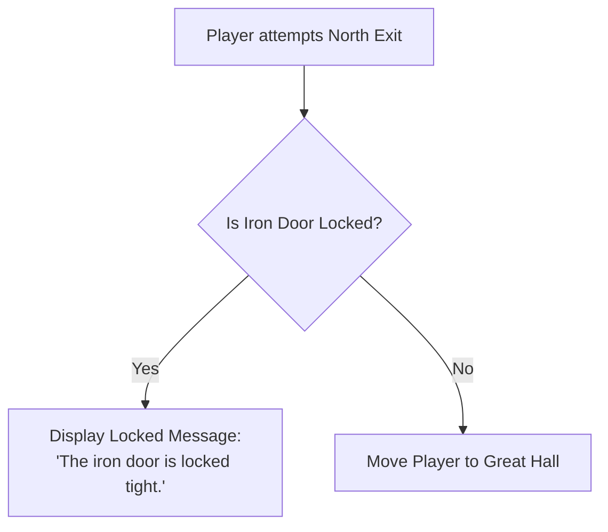

# Chapter 2: World Building: Rooms, Exits & Navigation

Rooms form the spatial backbone of your RagNext game. This chapter details how to create rooms, configure directional compass navigation, set up conditional exit locks, assign background media, and trigger room-specific actions.

---

## 2.1 Creating & Managing Rooms

### Creating a Room
1. In the left sidebar entity tree, click **Rooms**.
2. Click **➕ Add Room** at the bottom of the list.
3. In the Room Properties panel, enter:
   - **Name**: The display name of the location (e.g. *"Overgrown Courtyard"*).
   - **Description**: Rich narrative description shown when the player enters the room.

```
+-------------------------------------------------------------------------------+
| Overgrown Courtyard                                                           |
+-------------------------------------------------------------------------------+
| Stone walls crumble beneath thick ivy. To the north, a heavy iron door stands |
| locked. A marble fountain bubbles softly in the center of the yard.           |
+-------------------------------------------------------------------------------+
```

---

## 2.2 Directional Exits & Compass Navigation

RagNext features a built-in 12-way compass navigation matrix:

```
                  [ North (N) ]
       [ NW ]          |          [ NE ]
                       |
[ West (W) ] ----------+---------- [ East (E) ]
                       |
       [ SW ]          |          [ SE ]
                  [ South (S) ]

            [ Up ] / [ Down ] | [ In ] / [ Out ]
```

### Configuring Primary Exits
1. Select a room and open the **Exits** inspector panel.
2. For any direction (e.g. `North`), click the dropdown and select the destination room (e.g. *"Great Hall"*).
3. Check **Two-Way Exit** to automatically create the reciprocal return exit (e.g. setting Room A's `North` to Room B automatically sets Room B's `South` to Room A).

---

## 2.3 Conditional Exits & Door Locks

Often an exit should be blocked until a condition is met (e.g. player possesses a key or solved a puzzle).

### Lock Methods
1. **Key Object Lock**: Assign a key item (e.g. `IronKey`) to the exit. The exit remains locked until the player picks up `IronKey`.
2. **Action-Based Lock**: Use room action steps (`Lock Exit` / `Unlock Exit` commands) triggered when a puzzle condition passes in the Visual Action Graph.



---

## 2.4 Room Backgrounds & Media Assets

Enhance your text descriptions with 2D artwork and background music:

1. Import your media files into the project via **Media Assets**.
2. Select a room in the tree view.
3. In Room Properties, select a **Picture Asset** (e.g. `courtyard_art.jpg`).
4. Select a **Background Music Asset** (e.g. `ambient_wind.ogg`).

RagNextPlayer automatically cross-fades background music and updates the room image display when entering the room.

---

## 2.5 Room Action Triggers

Rooms support automatic event triggers executed when the player interacts with the environment:

| Trigger Event | Description | Use Case |
| :--- | :--- | :--- |
| `UserClicked` | Standard narrative verb selection | Clicking *"Examine Fountain"* in verb menu |
| `OnPlayerEnter` | Executes automatically when player steps into room | Trap triggers, plays cutscene dialogue |
| `OnPlayerExit` | Executes automatically before player leaves room | Guard stops player from leaving |

---

*Continue to [Chapter 3: Game Objects, Characters & Inventories](Chapter_03_Objects_Characters_Inventories.md)*
