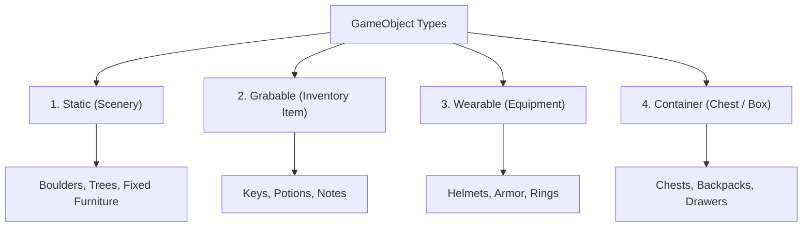

# Chapter 3: Game Objects, Characters & Inventories

Game Objects and Characters represent items, props, and non-player characters (NPCs) in your game world. This chapter covers object classifications, inventory management, player equipment slots, and character interaction popovers.

---

## 3.1 Object Classifications

Every `GameObject` in RagNext belongs to one of four primary types:



| Object Type | Player Behavior | Example |
| :--- | :--- | :--- |
| **Static** | Fixed in room; cannot be picked up | Statues, Large Boulders, Heavy Tables |
| **Grabable** | Can be picked up and added to Inventory | Rusty Keys, Magic Potions, Spell Scrolls |
| **Wearable** | Can be equipped on player equipment slots | Leather Armor, Silver Ring, Helmet |
| **Container** | Holds other objects inside its inventory | Wooden Chest, Backpack, Safe |

---

## 3.2 Inventory Management & Equipment Slots

### Managing Player Inventory
- When a `Grabable` item is picked up, it moves from the current `Room.Objects` collection into `Player.Inventory`.
- Items can be examined, dropped back into the current room, or used on other objects via action steps.

### Wearable Equipment Slots
Wearable items can be assigned to equipment slots:
- `Head`, `Chest`, `MainHand`, `OffHand`, `Ring`, `Feet`.
- Equipping an item auto-unequips any existing item in that slot and triggers custom equipment stats via action scripts.

---

## 3.3 Creating NPCs & Characters

Characters are active entities that inhabit rooms or travel across the world.

### Character Properties
- **Name**: e.g. *"Elder Wizard Glendor"*.
- **Gender & Portrait**: Character portrait image asset.
- **Starting Room**: The room where the NPC initially spawns.
- **Character Inventory**: Items carried by the NPC.

```
+-------------------------------------------------------------------------------+
| Elder Wizard Glendor                                                          |
+-------------------------------------------------------------------------------+
| [ Portrait: wizard.png ]                                                      |
| "Welcome, traveler. Beware the dark catacombs beneath the castle..."          |
|                                                                               |
| Actions: [ Talk ] [ Trade ] [ Examine ]                                       |
+-------------------------------------------------------------------------------+
```

---

## 3.4 Contextual Interaction Popovers & Verbs

In **RagNextPlayer**, clicking an object or character in the room view opens a **Contextual Action Popover** listing all active verbs:

- Clicking an NPC displays verbs like *"Talk"*, *"Examine"*, *"Attack"*.
- Clicking a Container displays verbs like *"Open Container"*, *"Inspect Lock"*.
- Executing an action runs the attached node graph sequence immediately.

---

*Continue to [Chapter 4: Game Variables, Expressions & Dynamic Text](Chapter_04_Variables_Expressions_Dynamic_Text.md)*
