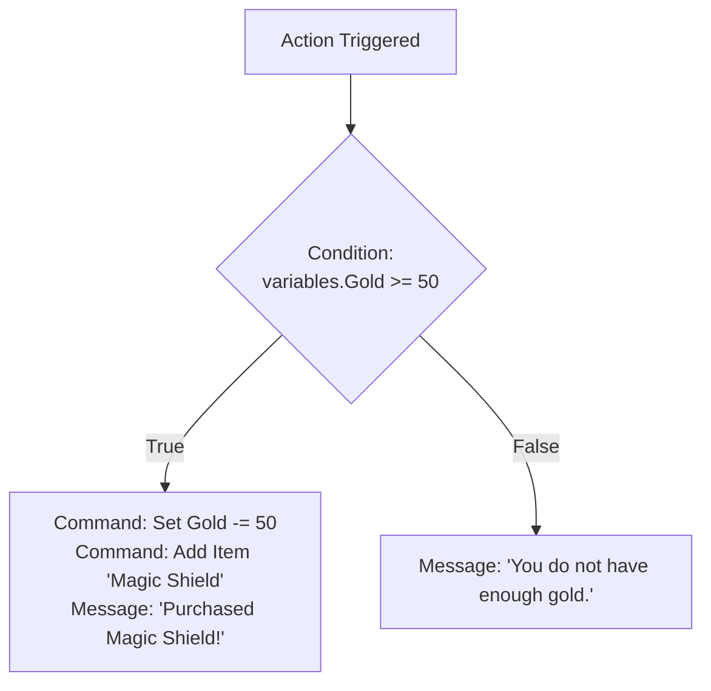

# Chapter 4: Game Variables, Expressions & Dynamic Text

Variables allow you to track score, health, quest progression, player stats, and puzzle states across your game. This chapter covers variable types, math operations, dynamic text template tags, and expression evaluation.

---

## 4.1 Variable Types

RagNext supports three fundamental variable types:

| Variable Type | Allowed Values | Use Case |
| :--- | :--- | :--- |
| **Integer** | Numeric integers (`0`, `-10`, `9999`) | Player HP, Gold, Score, Turn Count |
| **String** | Text strings (`"Hero"`, `"Paladin"`) | Player Title, Custom Names, Quest State |
| **Boolean** | Truth values (`True` / `False`) | `HasSpokenToGuard`, `ChestUnlocked` |

---

## 4.2 Initializing & Modifying Variables

### Creating Variables in Studio
1. In the left sidebar, click **Variables**.
2. Click **➕ Add Variable**.
3. Set the Variable Name (e.g. `PlayerHP`), Type (`Integer`), and Initial Value (`100`).

### Variable Action Commands
In the Visual Action Graph, you can modify variables dynamically using action commands:

- **Set Variable**: Assigns a new value (`Gold = 50`).
- **Modify Integer Variable**: Performs arithmetic additions or subtractions (`PlayerHP += 15` or `Gold -= 10`).
- **Toggle Boolean Variable**: Flips a boolean value (`HasMap = !HasMap`).

---

## 4.3 Dynamic Text Templating Tags

You can embed live variables inside Room Descriptions, Object Labels, Dialogue Messages, and Hotspot Buttons using template tags:

```
"Greetings, {player.Name}! You currently have {variables.Gold} gold coins and {variables.PlayerHP} HP."
```

### Template Tag Cheat Sheet

| Template Tag | Replaced With |
| :--- | :--- |
| `{variables.VariableName}` | Value of global variable `VariableName` |
| `{player.Name}` | Name of active player character |
| `{player.Gender}` | Gender string (`"Male"`, `"Female"`) |
| `{room.Name}` | Name of current room location |
| `{object.Name}` | Name of target object |

---

## 4.4 Expressions & Condition Evaluation

Variables are evaluated inside Action Graph **Conditions** to branch game logic:



---

*Continue to [Chapter 5: Visual Action Graph & Event Engine](Chapter_05_Visual_Action_Graph.md)*
