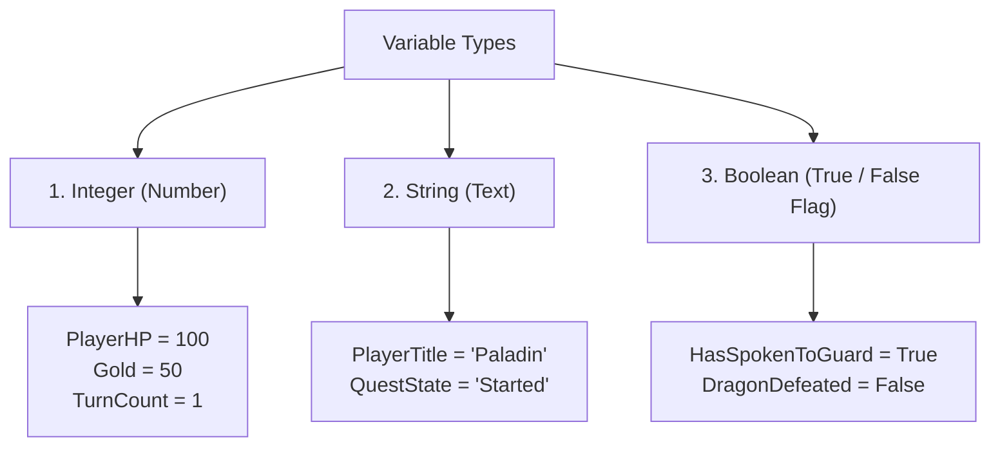
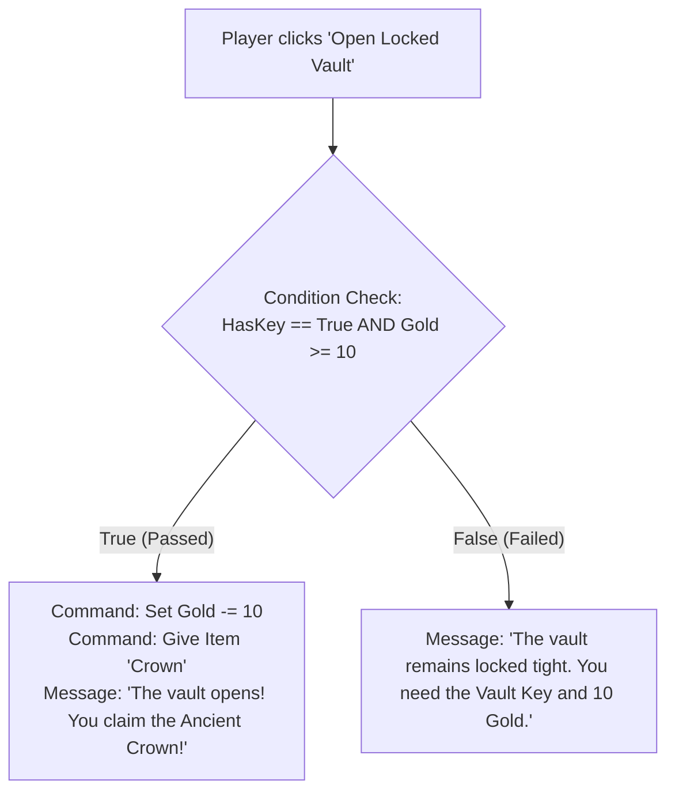

# Chapter 4: Game Variables, Expressions & Dynamic Text

Variables give your game a memory. They allow you to keep score, track player health, remember quest decisions, count turns, and customize story descriptions dynamically.

In this chapter, you will learn how to create variables, modify them with action steps, embed live variables into story text using template tags, and evaluate logic conditions.

---

## 4.1 Understanding Variable Types

In RagNext Studio, every global variable belongs to one of three easy-to-understand types:



| Variable Type | Allowed Values | Common Uses |
| :--- | :--- | :--- |
| **Integer** | Whole numbers (`0`, `100`, `-5`) | Health points, Gold, Mana, Score, Attack Damage |
| **String** | Text words or phrases (`"Hero"`, `"Chapter 1"`) | Player title, Custom names, Quest stage labels |
| **Boolean** | Truth values (`True` or `False`) | Story flags (*IsDoorUnlocked*, *HasSpokenToWizard*) |

---

## 4.2 Step-by-Step: Creating Global Variables

Let's create game variables in Studio:

### Step 1: Open the Variables Workspace
1. In the left navigation or top view rail, click **⚙️ Variables & Timers**.
2. Click **➕ Add Variable** at the bottom of the list.

### Step 2: Configure Variable Properties
Select the variable to edit its settings:
- **Name**: Give your variable a unique name without spaces (e.g. `PlayerHP`, `Gold`, `HasMap`).
- **Type**: Choose `Integer`, `String`, or `Boolean`.
- **Initial Value**: Set the default value when a new game starts (e.g. `100` for `PlayerHP`, `False` for `HasMap`).

---

## 4.3 Modifying Variables with Action Commands

Variables change as your player progresses through the game. In the Visual Action Graph (Chapter 5), you modify variables using intuitive action nodes:

### 1. Set Variable Node
Overwrites a variable with an exact new value:
- `Gold = 50`
- `HasSpokenToGuard = True`
- `PlayerTitle = "Master Thief"`

### 2. Modify Integer Variable Node
Performs arithmetic math on numeric variables:
- **Add / Increment**: `PlayerHP += 15` (healing potion) or `Gold += 100` (quest reward).
- **Subtract / Decrement**: `PlayerHP -= 10` (taking trap damage) or `Gold -= 25` (buying an item).

### 3. Toggle Boolean Variable Node
Flips a boolean flag back and forth:
- `HasMap = !HasMap`

---

## 4.4 Dynamic Text Templating Tags

One of RagNext's most powerful features for writers is **Dynamic Text Templating**. You can type template tags directly inside Room Descriptions, Object Labels, Speech Bubbles, and Hotspot Buttons!

When players play your game, RagNext replaces the tags in real time with live values:

```
"Welcome, {player.Name}! You currently have {variables.Gold} gold coins and {variables.PlayerHP} HP."
```

### Template Tag Reference Sheet

| Template Tag | Replaced With | Example Live Output |
| :--- | :--- | :--- |
| `{variables.Gold}` | Value of global variable `Gold` | `150` |
| `{variables.PlayerHP}` | Value of global variable `PlayerHP` | `85` |
| `{player.Name}` | Name of active player character | `Sir Gareth` |
| `{room.Name}` | Display name of current room | `Overgrown Courtyard` |
| `{object.Name}` | Display name of target object | `Rusty Brass Key` |

> [!TIP]
> **Dynamic Hotspot Labels**: You can use template tags inside Interactive Screen Hotspot text! For example, a button labeled `[ HEAL ({variables.PotionsLeft}) ]` will update automatically as potions are consumed.

---

## 4.5 Condition Evaluation & Story Branching

Variables allow you to branch your story based on player choices:



---

## Chapter 4 Hands-On Exercise

In Studio, set up the following variables for your game:

1. `PlayerHP` (Integer, Initial Value = `100`).
2. `Gold` (Integer, Initial Value = `50`).
3. `FoundSecretDoor` (Boolean, Initial Value = `False`).
4. Write a Room Description using tags:
   > *"Welcome to the Tavern, {player.Name}. You have {variables.Gold} gold in your pouch."*
5. Save your project!

---

*Continue to [Chapter 5: Visual Action Graph & Event Engine](Chapter_05_Visual_Action_Graph.md)*
