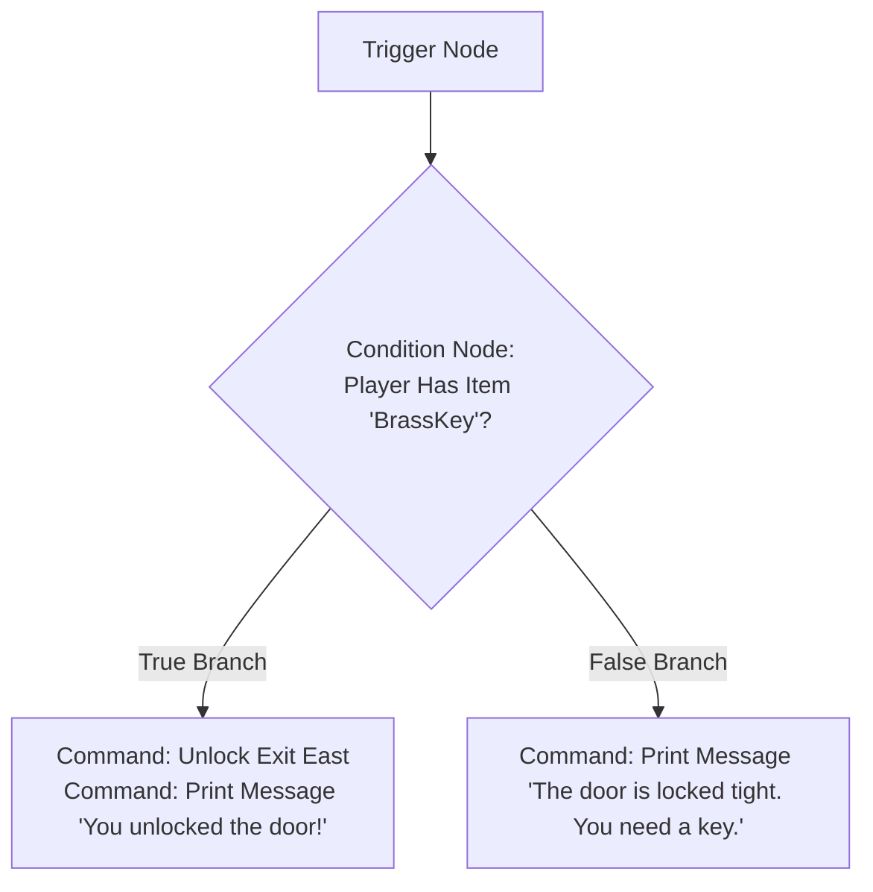

# Chapter 5: The Visual Action Graph & Event Engine

The Visual Action Graph is where you bring your story to life with game logic, dialogues, puzzles, sound effects, and room transitions. Instead of writing code, you connect visual nodes together on an intuitive canvas.

In this chapter, you will learn how the Visual Graph Editor works, explore action triggers, master Commands vs. Conditions, and build reusable Global Functions.

---

## 5.1 Overview of the Visual Action Graph

When you edit an Action on a Room, Object, or Hotspot, clicking **🎨 Visual Graph Editor** opens the full-screen node editor:

```
+-----------------------------------------------------------------------------------+
| VISUAL ACTION GRAPH: "Pull Hidden Lever"                                          |
+-----------------------------------------------------------------------------------+
|                                                                                   |
|  [ ⚡ Trigger: UserClicked ]                                                      |
|              |                                                                    |
|              v                                                                    |
|  [ ❓ Condition: Variable 'SecretPassageOpen' == False ]                          |
|         /                                  \                                      |
|    (True)                                (False)                                  |
|      |                                      |                                     |
|      v                                      v                                     |
|  [ ⚙️ Set Variable: SecretPassageOpen=True ] [ 💬 Message: "The lever is stuck." ]|
|  [ 🔓 Unlock Exit: East ]                                                         |
|  [ 🎵 Play Sound: heavy_gears.wav ]                                               |
|  [ 💬 Message: "A hidden passage opens!" ]                                        |
|                                                                                   |
+-----------------------------------------------------------------------------------+
```

---

## 5.2 Understanding Action Triggers

Every action sequence begins with a **Trigger Node**. The trigger defines *when* the action executes:

| Action Trigger | How It Fires | Common Example Use Case |
| :--- | :--- | :--- |
| `UserClicked` | Player selects a text verb or clicks a hotspot button | Inspecting a bookshelf, clicking an "Attack" button |
| `OnPlayerEnter` | Fires automatically when the player enters a room | Stepping onto a trapdoor, triggering an entrance cutscene |
| `OnPlayerExit` | Fires automatically before the player leaves a room | A guard stopping the player from leaving without a pass |
| `OnGameStart` | Fires once when a new game starts | Giving the player starting gold and initial items |
| `OnGameLoad` | Fires immediately after loading a saved game session | Restoring custom UI states or resuming background audio |
| `OnTurnTick` | Fires on every turn tick | Poison damage ticks, hunger meter countdowns |
| `OnObjectTaken` | Fires when an item is picked up | Alarming guards when a cursed jewel is taken |

---

## 5.3 Commands vs. Conditions

Nodes in the Action Graph are divided into two main categories: **Commands** and **Conditions**.

### 1. Commands (State Mutators & Story Actions)
Commands perform sequential actions in your game world. When executed, control flows from one command node directly to the next:

- **Set Variable / Modify Variable**: Update numeric counters or story flags.
- **Give Item / Take Item**: Add or remove items from player inventory.
- **Move Player**: Transport the player to a destination room.
- **Unlock Exit / Lock Exit**: Open or lock compass directions.
- **Play Sound / Play Music**: Trigger audio effects or background tracks.
- **Print Message / Show Dialog**: Display story narrative or character speech.
- **Show Interactive Screen / Close Screen**: Open visual GUI panels or return to the room.

### 2. Conditions (Logic Evaluators & Branching)
Conditions evaluate your game state and split execution into two paths: **True Branch** and **False Branch**.



---

## 5.4 Step-by-Step: Authoring an Action Graph

Let's build a simple puzzle action step-by-step:

### Step 1: Create an Action
1. Select an object (e.g. `Stone Statue`).
2. In the Actions panel, click **➕ Add Action**.
3. Name the action `Push Statue Left`.

### Step 2: Open the Visual Graph Editor
1. Click **🎨 Visual Graph Editor**.
2. The central workspace transforms into the Visual Graph Canvas.

### Step 3: Add Action Nodes
1. Click **➕ Add Command Node** or right-click the canvas.
2. Select **Play Sound** $\rightarrow$ choose `stone_slide.wav`.
3. Click **➕ Add Command Node** $\rightarrow$ select **Unlock Exit** $\rightarrow$ choose direction `North`.
4. Click **➕ Add Command Node** $\rightarrow$ select **Print Message** $\rightarrow$ type:
   > *"You push the heavy stone statue aside, revealing a secret doorway to the North!"*

### Step 4: Save & Test
Click **Save Action Graph**. Your puzzle action is ready for players!

---

## 5.5 Global Functions & Reusable Action Templates

If you have an action sequence that needs to be triggered from multiple places (e.g. *Calculate Level Up*, *Game Over Reset*, or *Update Quest Log*):

1. Go to **🧩 Global Functions** in the left sidebar.
2. Click **➕ Add Function** (e.g. `ResetPlayerStats`).
3. Build the action graph once inside the Global Function.
4. Anywhere else in your game, add an **Execute Function** command node selecting `ResetPlayerStats`!

---

## Chapter 5 Hands-On Exercise

In Studio, build a secret compartment puzzle:

1. Create a `Desk` object (Static).
2. Add an Action `Search Secret Drawer`.
3. Open **🎨 Visual Graph Editor**.
4. Add a Condition: `HasKey == False`.
   - **True**: `Set Variable HasKey = True`, `Give Item 'GoldKey'`, `Print Message ("You found a Gold Key inside the hidden drawer!")`.
   - **False**: `Print Message ("The secret drawer is empty.")`.
5. Save your action graph!

---

*Continue to [Chapter 6: Interactive Screens & Hotspots](Chapter_06_Interactive_Screens_Hotspots.md)*
