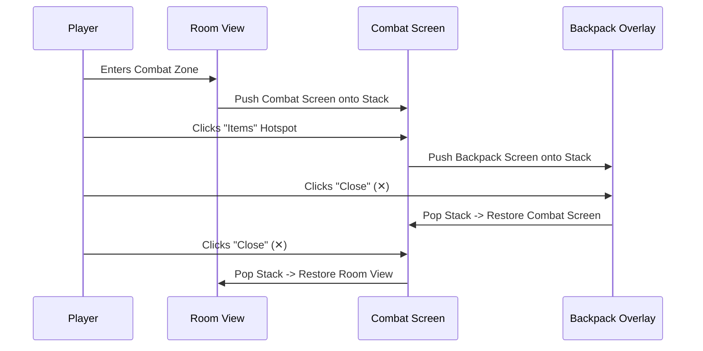

# Chapter 6: Interactive Screens & Hotspots

Interactive Screens allow you to create visual GUI overlays, combat engines, backpack menus, keypads, and point-and-click minigames in RagNext. This chapter covers canvas positioning, hotspot styling, self-contained inline action logic, and nested screen stack navigation.

---

## 6.1 Interactive Mode & The 16:9 Canvas

Interactive Screens can be configured on any **Room** or **GameObject**.

```
+-------------------------------------------------------------------------------+
| Live Screen Coordinates Preview (16:9 Aspect Ratio)                           |
+-------------------------------------------------------------------------------+
|  +-------------------------------------------------------------------------+  |
|  | [ Backdrop Artwork Image ]                                              |  |
|  |                                                                         |  |
|  |   +---------------+   +---------------+   +---------------+             |  |
|  |   | Hotspot:      |   | Hotspot:      |   | Hotspot:      |             |  |
|  |   | [ ATTACK ]    |   | [ MAGIC ]     |   | [ DEFEND ]    |             |  |
|  |   +---------------+   +---------------+   +---------------+             |  |
|  |                                                                         |  |
|  +-------------------------------------------------------------------------+  |
+-------------------------------------------------------------------------------+
```

### 16:9 Percentage Coordinate Space
All hotspots use percentage coordinates (`0%` to `100%` width and height). This guarantees that your interactive screens maintain pixel-accurate button alignment regardless of display resolution or aspect ratio.

---

## 6.2 Creating & Styling Hotspots

### Drag-to-Position Sync
- In the Studio Live Screen Coordinates Preview, click and drag any hotspot box to set its coordinates.
- Clicking a hotspot automatically reveals its property inspector on the left panel.

### Hotspot Style Types
1. **Invisible**: Creates a transparent clickable region over buttons drawn directly into your background artwork.
2. **TextButton**: Renders customizable label text with background color, font color, and font size.
3. **ImageButton**: Displays a sprite image asset over the hotspot region.
4. **CustomBorder**: Displays custom border widths and background styling.

### Hover Grow Micro-Animations
Check **Enable Hover Grow Effect** on a hotspot to enable automatic 1.08x scaling transitions when a player hovers over the button in RagNextPlayer.

---

## 6.3 Self-Contained Inline Action Steps

Hotspot click logic is self-contained directly inside the hotspot:

1. Select a hotspot in the list.
2. Click **🎨 Edit Hotspot Action Steps**.
3. Studio opens the Visual Action Graph for that hotspot.
4. Add commands such as `Set Variable`, `Play Sound`, `Show Dialog`, or `Show Item Interactive Screen`.

---

## 6.4 Nested Interactive Screens & Navigation Stack

RagNextPlayer features an internal **Navigation Stack** (`Stack<InteractiveScreenContext>`) that supports infinite screen nesting.

### How Nested Screens Work



### On Close Triggers
When a screen closes (via the top-right `✕` close button or a `Close Screen` action step), RagNext executes any global function assigned to **On Close Linked Action**, resuming music or unpausing turn clocks!

---

*Continue to [Chapter 7: Advanced Game Mechanics: Timers & Global Functions](Chapter_07_Advanced_Mechanics_Timers_Functions.md)*
