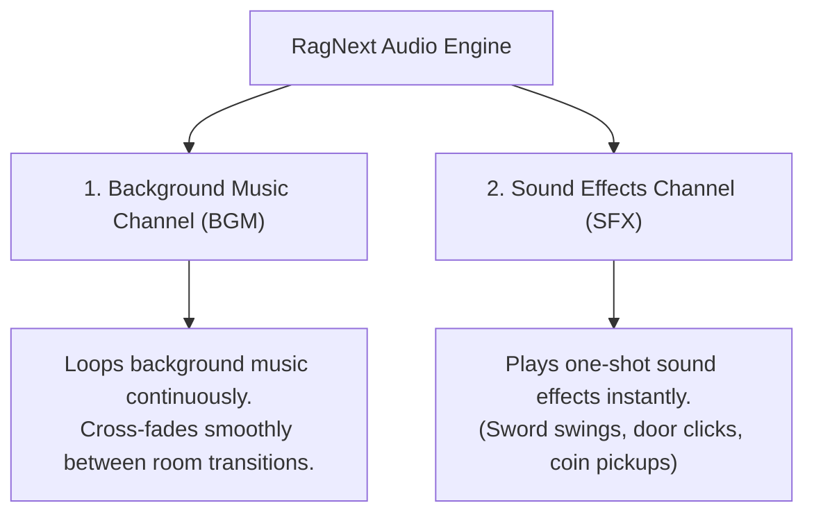

# Chapter 8: Sound FX, Media & Visual Polish

Sound effects, background music, artwork, and visual screen transitions turn a good interactive story into an unforgettable experience.

In this chapter, you will learn how to import media assets, manage dual-channel audio playback, trigger sound FX and background music, use screen shakes, and apply theme styling.

---

## 8.1 Importing & Managing Media Assets

RagNext supports industry-standard image and audio formats:

- **Image Assets**: `.png`, `.jpg`, `.jpeg`, `.webp` (Used for Room Backgrounds, Object Sprites, Character Portraits, and Screen Backdrops).
- **Audio Assets**: `.wav`, `.mp3`, `.ogg` (Used for Sound Effects and Background Music).

### Step-by-Step: Importing Assets into Studio
1. In the left navigation rail, click **🖼️ Media Assets**.
2. Click **➕ Import Assets** at the top of the asset manager.
3. A file browser opens. Select one or more image or audio files from your computer and click **Open**.
4. Studio imports the files into your project's local media asset library and assigns them friendly Asset IDs (e.g. `sword_slash.wav`, `tavern_theme.ogg`).

---

## 8.2 Dual-Channel Audio Playback

RagNextPlayer features an internal **Dual-Channel Audio Engine**:

### Triggering Audio in Action Graphs

- **Play Sound Node**: Plays a one-shot SFX on the sound effects channel:
  - Select asset: `coin_pickup.wav`
  - Volume slider: `80%`
- **Play Music Node**: Starts background music on the BGM channel:
  - Select asset: `dungeon_theme.ogg`
  - Check **Loop Continuously**: Keeps the music playing while the player explores.
- **Stop Music Node**: Fades out and stops current background music.

---

## 8.3 Screen Shakes & Visual Transition Effects

Visual polish adds dramatic punch to critical story moments!

### Screen Shake Effect (`Trigger Screen Shake`)
In the Action Graph, add a **Screen Shake** node during explosive actions (e.g. dragon attacks, earthquakes, wall collapses):
- **Duration**: `0.5` seconds.
- **Intensity**: `2.0` (Subtle rumble) to `5.0` (Heavy earthquake).

---

## Chapter 8 Hands-On Exercise

In Studio, polish your game's atmosphere:

1. Import a background music file `mystic_cave.mp3` and sound effect `chest_open.wav`.
2. Select your starting room and set its **Background Music** to `mystic_cave.mp3`.
3. Open the Action Graph on a `Treasure Chest` object:
   - Add command node **Play Sound**: `chest_open.wav`.
   - Add command node **Screen Shake**: Duration = `0.3s`, Intensity = `2.0`.
4. Save your game!

---

*Continue to [Chapter 9: Building, Testing & Publishing Your Game](Chapter_09_Building_Testing_Publishing.md)*
