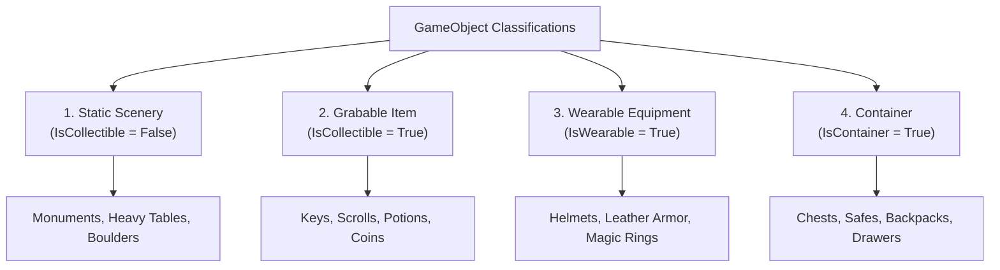

# Chapter 3: Game Objects, Characters & Inventories

Game Objects and Characters bring your story world to life. Objects can be static scenery items, grabable inventory items, wearable equipment, or containers like chests and backpacks. Characters represent non-player characters (NPCs), companions, merchants, or enemies.

In this chapter, you will learn how to create and classify items, set up player inventories, manage equipment slots, create NPCs, and configure contextual interaction popovers.

---

## 3.1 Understanding Game Objects

In RagNext, any physical item or prop in your world is a **`GameObject`**. An object can exist in a room, inside a player's inventory, inside a chest, or equipped on a character.



---

## 3.2 Step-by-Step: Creating a Game Object

Let's create a new item in Studio:

### Step 1: Open the Objects Workspace
1. In the top toolbar or left navigation rail, click **🎒 Objects**.
2. Click **➕ Add Object** at the bottom of the objects list.

### Step 2: Configure Object Attributes
Select the new object to reveal its properties in the main workspace:

- **Name**: Enter an item name (e.g. `Rusty Brass Key`).
- **Description**: Type what the player sees when inspecting the item.
  > *Example*: *"A heavy brass key tarnished with age. The bow is shaped like an oak leaf."*
- **Picture Asset**: (Optional) Assign an item illustration sprite or thumbnail image.

---

## 3.3 Object Types & Behavior Flags

Toggle object behavior flags in the Object Inspector to define how players interact with the item:

### 1. Static Scenery (`IsCollectible = False`)
Uncheck **Is Collectible**.
- The item stays fixed in its room.
- Players can inspect or interact with it (*"Examine Statue"*), but cannot take it into their inventory.

### 2. Grabable Items (`IsCollectible = True`)
Check **Is Collectible**.
- Players can take the item into their inventory using the default *"Take"* verb.
- The item moves from the current room's object list into `Player.Inventory`.

### 3. Wearable Equipment (`IsWearable = True`)
Check **Is Wearable** and specify a **Wear Slot**:
- Available slots: `Head`, `Chest`, `MainHand`, `OffHand`, `Ring`, `Feet`.
- When a player equips the item, RagNext Player automatically moves it to their equipment slot and updates character stats!

### 4. Container Objects (`IsContainer = True`)
Check **Is Container**.
- Allows the object to hold other game objects inside it (e.g. a `Treasure Chest` containing a `Magic Sword` and `50 Gold`).
- You can toggle **Is Open** or attach action steps to lock/unlock the container.

---

## 3.4 Creating NPCs & Characters

Characters represent living entities in your game world (allies, villains, shopkeepers, or monsters).

```
+-------------------------------------------------------------------------------+
| NPC: Captain Morgana                                                          |
+-------------------------------------------------------------------------------+
| [ Portrait: morgana_portrait.png ]                                            |
|                                                                               |
| A weathered pirate captain with a tricorn hat and a sharp eyepatch.           |
|                                                                               |
| Location: Pirate Cove Tavern                                                  |
| Character Inventory: [ Treasure Map Fragment ]  [ Cutlass ]                   |
| Actions / Dialogue: [ Talk to Captain Morgana ]  [ Trade Items ]              |
+-------------------------------------------------------------------------------+
```

### Step-by-Step: Adding an NPC
1. In the left navigation, click **👤 Characters**.
2. Click **➕ Add Character**.
3. Set **Name** (e.g. `Captain Morgana`).
4. Set **Starting Location**: Select the room where the character appears (e.g. `Pirate Cove Tavern`).
5. Set **Portrait Image**: Assign a character headshot image asset.
6. Write character descriptions and add character actions (e.g. *"Talk to Captain Morgana"*).

---

## 3.5 Contextual Interaction Popovers in Player

In **RagNextPlayer**, when a player clicks an object or character in the room view or interactive screen, RagNext opens a **Contextual Action Popover**:

```
+------------------------------------+
|  Rusty Brass Key                   |
+------------------------------------+
|  [ 👁️ Examine ]                   |
|  [ ✋ Take Item ]                  |
|  [ 🧪 Use Key On... ]             |
+------------------------------------+
```

The popover dynamically displays only the active, enabled actions for that target, ensuring your players always have clear visual choices!
