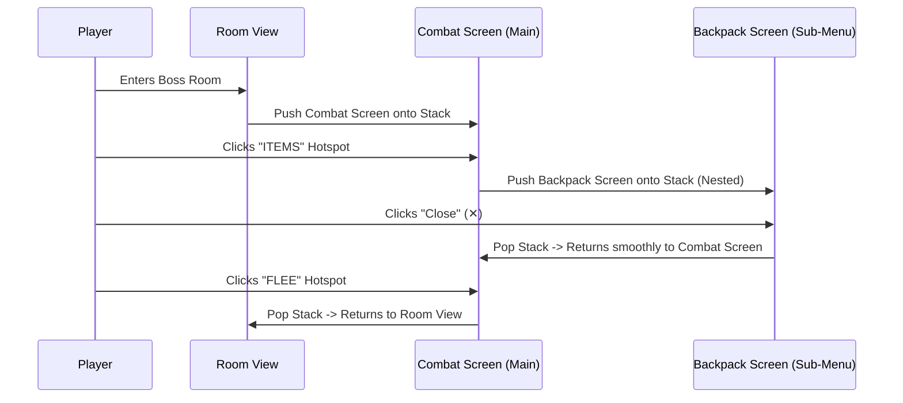

# Chapter 6: Interactive Screens, Hotspots & Nested Menus

Interactive Screens transform RagNext from a text adventure engine into a full visual GUI engine. With Interactive Screens, you can create point-and-click graphic interfaces, custom RPG battle HUDs, interactive backpacks, digital keypad locks, and shopkeeper trading screens.

In this chapter, you will learn how to enable interactive screens, position and style hotspot buttons, build self-contained inline action logic, and nest interactive screens on a navigation stack.

---

## 6.1 Understanding Interactive Screens

An Interactive Screen is a visual GUI overlay that displays above a **Room** or **GameObject**.

```
+-------------------------------------------------------------------------------+
| Live Screen Coordinates Preview (Fixed 16:9 Aspect Ratio)                     |
+-------------------------------------------------------------------------------+
|  +-------------------------------------------------------------------------+  |
|  | [ Backdrop Image: combat_background.jpg ]                               |  |
|  |                                                                         |  |
|  |   +---------------+   +---------------+   +---------------+             |  |
|  |   | Hotspot:      |   | Hotspot:      |   | Hotspot:      |             |  |
|  |   | [ ATTACK ]    |   | [ ITEMS ]     |   | [ FLEE ]      |             |  |
|  |   +---------------+   +---------------+   +---------------+             |  |
|  |                                                                         |  |
|  +-------------------------------------------------------------------------+  |
+-------------------------------------------------------------------------------+
```

### The 16:9 Percentage Coordinate Space
Interactive Screen canvases use a standardized **16:9 percentage coordinate space**:
- `X` and `Width` are measured from `0%` (left edge) to `100%` (right edge).
- `Y` and `Height` are measured from `0%` (top edge) to `100%` (bottom edge).

Because coordinates are stored as percentages, your hotspot buttons automatically scale and align perfectly on any screen size—from 4K desktop monitors to smartphones!

### Backdrop Image Resolutions & Recommendations for Artists
Do you need to export your artwork at an exact pixel size?
- **Aspect Ratio is Key**: Hotspots are tied to the **16:9 aspect ratio container**, not fixed pixel counts. As long as your background image is created in a 16:9 aspect ratio, hotspots will stay perfectly aligned regardless of image resolution.
- **Recommended Pixel Resolutions for Artists**: When creating or generating artwork in Photoshop, Procreate, Canva, or Midjourney, we recommend exporting at standard 16:9 resolutions:
  - **`1920 × 1080`** (Standard Full HD — Recommended for crisp visuals and fast loading)
  - **`2560 × 1440`** (2K QHD for high-DPI displays)
  - **`3840 × 2160`** (4K Ultra HD for maximum detail)
  - **`1280 × 720`** (HD for smaller file sizes)

---

## 6.2 Step-by-Step: Enabling an Interactive Screen

Interactive screens can be attached to any Room or GameObject.

### Step 1: Select a Room or Object
1. Select a Room or Object in Studio (e.g. `Boss Battle Arena`).
2. Click the **Interactive Screen** tab at the top of the main workspace.

### Step 2: Configure Screen Settings
Check the settings at the top of the panel:
- **Enable Interactive Mode**: Check to turn on the screen overlay.
- **Show Close Button (Top Right '✕')**: Check if players should see an automatic `✕` button to exit the screen.
- **Backdrop Asset ID**: Select your background artwork image (e.g. `battle_arena.png`).
- **On Close Linked Action**: (Optional) Select a Global Function to run whenever this screen closes.

---

## 6.3 Creating & Styling Hotspot Buttons

Hotspots are the clickable region buttons placed on your screen backdrop.

### Adding & Positioning Hotspots
1. Click **➕ Add Hotspot** under the Clickable Hotspots header.
2. A new hotspot box appears on the 16:9 Live Preview canvas.
3. **Click and Drag**: Click and drag the hotspot box anywhere on the canvas preview to position it visually.
4. **Auto-Select Sync**: Clicking a hotspot box in the canvas preview automatically selects it in the hotspots list and opens its property inspector!

```
+-------------------------------------------------------------------------------+
| HOTSPOT PROPERTY INSPECTOR                                                    |
+-------------------------------------------------------------------------------+
| Name: AttackButton                                                            |
| Style Type: TextButton                                                        |
| Label Text: ⚔️ ATTACK                                                         |
| Font Color: #FFFFFF                                                           |
| Background Color: #8E2DE2                                                     |
| Enable Hover Scale Grow: [x] Enabled                                          |
+-------------------------------------------------------------------------------+
```

### Hotspot Style Types
Choose how your hotspot button looks:
1. **Invisible**: Creates a transparent hit region over buttons already drawn into your backdrop image artwork.
2. **TextButton**: Displays custom styled label text with a background color and border.
3. **ImageButton**: Displays a sprite thumbnail image asset.
4. **CustomBorder**: Renders a highlighted frame over interactive props.

### Micro-Animations: Hover Scale Grow Effect
Check **Enable Hover Scale Grow Effect**. In **RagNextPlayer**, hovering over the button smoothly enlarges it by 1.08x, giving your game a sleek, modern feel!

---

## 6.4 Authoring Inline Hotspot Action Logic

Every hotspot has **self-contained action steps**:

1. Select a hotspot in your hotspots list.
2. Click the prominent **`🎨 Edit Hotspot Action Steps`** button.
3. Studio opens the Visual Action Graph for that specific hotspot.
4. Add any sequence of action steps:
   - `Modify Integer: MonsterHP -= 15`
   - `Play Sound: sword_slash.wav`
   - `Print Message: "You attack the monster!"`
   - `Show Item Interactive Screen`: Launch a sub-menu!

---

## 6.5 Nested Interactive Screens & Stack Navigation

RagNext supports **infinite screen nesting** using an automatic Navigation Stack (`Push` and `Pop` screen mechanics).

### Example: Combat Engine with Backpack Sub-Menu



### How Screen Nesting Works
- When a hotspot action step executes `Show Item Interactive Screen`, RagNext **pushes** the new screen on top of the navigation stack.
- Clicking the top-right `✕` close button (or executing a `Close Screen` command) **pops** the top screen off the stack, instantly restoring the underlying screen underneath!
- You can nest screens as deeply as you want (e.g., *Main Screen* $\rightarrow$ *Inventory* $\rightarrow$ *Item Details* $\rightarrow$ *Spellbook*).

---

## 6.6 Focus Canvas Mode (`⤢`) & Resizable Splitters

Studio includes power tools for designing interactive screens:

- **Focus Canvas Mode (`⤢`)**: Click the purple `⤢` button in the screen header to hide all left navigation rails, expanding your canvas preview across 95%+ of your monitor window.
- **Resizable Panel Splitter (`GridSplitter`)**: Click and drag the vertical splitter bar between the Hotspot Inspector and Canvas Preview to adjust inspector width to any size you like.
