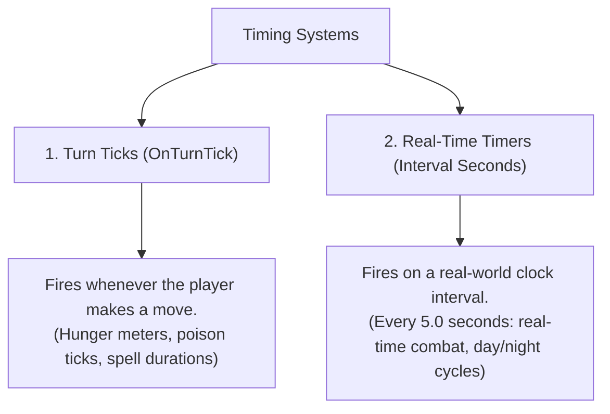

# Chapter 7: Advanced Game Mechanics — Timers & Global Functions

As your game grows, you will want background systems that run automatically—such as real-time day/night cycles, turn counters, ambient weather updates, periodic monster spawns, or reusable global action routines.

In this chapter, you will learn how to use Real-Time Timers, Turn Ticks, Global Functions, and Game Lifecycle Hooks.

---

## 7.1 Real-Time Timers vs. Turn Ticks

RagNext provides two complementary timing systems:

| Timing System | Trigger Condition | Example Game Use Cases |
| :--- | :--- | :--- |
| **Turn Ticks (`OnTurnTick`)** | Player executes an action or moves between rooms | Hunger meter decreases by 1, poison inflicts damage |
| **Real-Time Timers (`Timer`)** | Fixed real-time interval (e.g. every `5.0` seconds) | Real-time torch burn out, ticking bomb countdowns |

---

## 7.2 Step-by-Step: Creating a Real-Time Timer

Let's create a real-time countdown timer in Studio:

### Step 1: Open the Timers Workspace
1. In the left navigation or top view rail, click **⚙️ Variables & Timers**.
2. Scroll down to the **Timers** section.
3. Click **➕ Add Timer**.

### Step 2: Configure Timer Attributes
- **Name**: Give your timer a name (e.g. `TorchBurnTimer`).
- **Interval Seconds**: Set how often the timer fires in real seconds (e.g. `10.0` seconds).
- **Initially Active**: Check to start the timer immediately when the game loads.

### Step 3: Author Timer Action Steps
1. Select your timer and click **🎨 Visual Graph Editor**.
2. Add action steps:
   - `Modify Integer: TorchLight -= 1`
   - `Condition: TorchLight <= 0`:
     - **True**: `Print Message ("Your torch flickers and dies! Darkness surrounds you.")`

---

## 7.3 Global Functions (`CurrentGame.Functions`)

A **Global Function** is a central action sequence stored at the project root level.

### Why Use Global Functions?
1. **Reuse Logic**: Instead of rebuilding the exact same *"Level Up"* or *"Calculate Combat Damage"* graph on 20 different enemies, build it once under Global Functions and call it anywhere!
2. **Clean Organization**: Keep your room and object actions lightweight by delegating heavy calculations to global functions.
3. **On Close Hooks**: Assign a global function to an Interactive Screen's `On Close Linked Action` to handle cleanups.

### Step-by-Step: Creating a Global Function
1. In the left navigation rail, click **🧩 Global Functions**.
2. Click **➕ Add Function** (e.g. `AwardQuestReward`).
3. Click **🎨 Visual Graph Editor** and add your reward steps:
   - `Modify Integer: Gold += 100`
   - `Modify Integer: PlayerXP += 500`
   - `Play Sound: quest_fanfare.wav`
   - `Print Message ("Quest Complete! You received 100 Gold and 500 XP!")`

---

## 7.4 Game Save & Load Hooks

RagNext includes two automatic lifecycle trigger events:

- **`OnGameStart`**: Executes once when a player launches a brand-new game session. Use this to display introductory story text, initialize starting items, or set starting variables.
- **`OnGameLoad`**: Executes immediately after a player loads a saved game file. Use this to restore custom UI overlays, resume background music, or refresh status bars.
